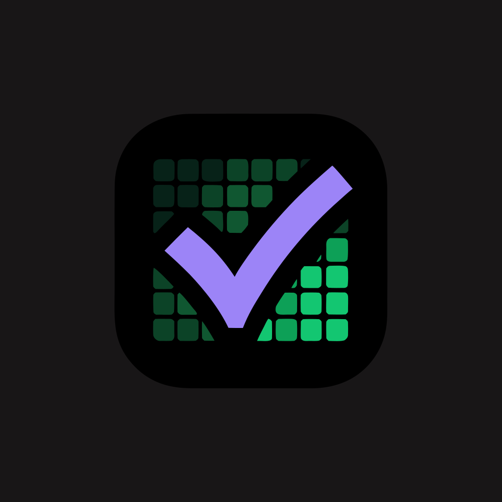

<div align="center">



# Streakly

**A simple, good-looking habit tracker with streaks.**

Build habits, tick off one-off tasks, and watch your streaks grow on a
GitHub-style contribution heatmap.

[](https://flutter.dev)
[](https://dart.dev)
[]()
[]()
[](https://pub.dev/packages/flutter_lints)

</div>

---

## Screenshots

> Add your own screenshots to `docs/screenshots/` and they will show up here.

|                Today                 |               Statistics                |               Year view                |
| :----------------------------------: | :-------------------------------------: | :------------------------------------: |
|  |  |  |

---

## Features

- 🔥 **Streaks** – current and best streak for every habit, with a haptic tick on completion
- 🟩 **Contribution heatmap** – GitHub-style activity grid, monthly on the home screen and a full-year view
- ✅ **Habits & one-off tasks** – recurring habits plus dated to-dos, both in one place
- 📅 **Per-habit calendar** – backfill or undo any past day
- 📊 **Statistics** – 30-day success rate, longest streak, total check-ins
- 🔔 **Daily reminder** – one local notification at a time you choose, timezone-aware
- 🎨 **Accent colour picker** – recolours the whole app instantly, saved between sessions
- 👤 **Profile** – name and photo, stored locally
- 🌙 **Dark theme** throughout
- 💾 **Crash-safe storage** – corrupt data is detected and backed up instead of silently overwritten

---

## Tech stack

| Area             | Choice                                                             |
| ---------------- | ----------------------------------------------------------------- |
| Framework        | Flutter (Material 3)                                              |
| Language         | Dart 3                                                            |
| State management | [`provider`](https://pub.dev/packages/provider) – a single `AppState` `ChangeNotifier` |
| Persistence      | [`shared_preferences`](https://pub.dev/packages/shared_preferences) (JSON) |
| Notifications    | [`flutter_local_notifications`](https://pub.dev/packages/flutter_local_notifications) + [`timezone`](https://pub.dev/packages/timezone) |
| Media            | [`image_picker`](https://pub.dev/packages/image_picker), [`audioplayers`](https://pub.dev/packages/audioplayers) |
| Dev preview      | [`device_preview`](https://pub.dev/packages/device_preview)       |

---

## Getting started

### Prerequisites

- Flutter SDK `>=3.0.0` (tested on 3.47)
- A device, emulator, or Chrome

### Run

```bash
git clone https://github.com/sako4018/Habit-tracker.git
cd Habit-tracker
flutter pub get
flutter run
```

### Build

```bash
flutter build apk        # Android
flutter build web        # Web
flutter build windows    # Windows desktop
```

---

## Project structure

```
lib/
├── main.dart                  # app entry, theme, provider + login gate
├── models/                    # Habit, Task – plain data + streak logic
├── services/                  # storage (with corruption guard), notifications, profile
├── state/
│   └── app_state.dart         # single source of truth for habits & tasks
├── screens/                   # home, stats, settings, calendar, year view, login, profile
├── widgets/                   # habit card, heatmap, stat card, dialogs …
└── theme/                     # colours + accent colour controller
```

State lives in `AppState` (a `ChangeNotifier` provided above `MaterialApp`).
Screens read it with `context.watch<AppState>()` and mutate it with
`context.read<AppState>()` – no data is passed screen-to-screen.

---

## Testing

```bash
flutter test
```

36 tests covering:

- streak / best-streak / weekly logic on `Habit`
- JSON round-trips for both models
- storage: save/load, `StorageException` on corrupt data, empty-overwrite guard
- `AppState`: write-locking when storage is corrupt, `clearAllData`, listener notifications
- widget tests that the home screen repaints when `AppState` changes

---

## Roadmap

The plan is split into small, shippable releases. Each one should leave the app
usable and the test suite green.

### v1.1 – Storage & data safety

- [ ] Local database (`sqflite` / `hive`) instead of a single JSON blob
- [ ] Data export / import (backup to a file, restore from it)
- [ ] Versioned data migrations with a schema version field
- [ ] Automatic local backup before every migration

### v1.2 – Scheduling

- [ ] Weekly / custom habit schedules (e.g. Mon-Wed-Fri only)
- [ ] More than one reminder per day
- [ ] Per-habit reminder times instead of one global time
- [ ] "Skip today" that does not break the streak (planned rest days)

### v1.3 – Insights

- [ ] Line chart of success rate over time
- [ ] Per-weekday breakdown (which days you miss most)
- [ ] Month and year summaries next to the current 30-day view
- [ ] "Best month" and "current pace" cards

### v1.4 – Platform integration

- [ ] Home-screen widget (Android) showing today's habits
- [ ] Quick actions / app shortcuts to tick the top habit
- [ ] Notification action button to mark done without opening the app
- [ ] Wear OS companion tile (stretch)

### v2.0 – Sync & accounts

- [ ] Optional account (email or passkey), app stays fully usable offline
- [ ] End-to-end encrypted cloud sync across devices
- [ ] Conflict resolution: last-write-wins per day-key, never lose a check-in
- [ ] Web build reads the same synced data

### Ideas / maybe

Not committed to a release yet:

- [ ] Habit categories and folders
- [ ] Localisation beyond Bulgarian (English first)
- [ ] Themes and light mode
- [ ] Streak-freeze tokens you earn by being consistent
- [ ] Shareable streak image for social media
- [ ] Import from other habit apps (Loop, HabitKit)

### Non-goals

To keep the app small and calm, these are intentionally out of scope:

- Social feed, friends, following, comments
- Ads or paywalled core features
- Gamification with points, coins, or leaderboards
- Always-on background tracking or location

---

## License

No license yet – all rights reserved by the author.
